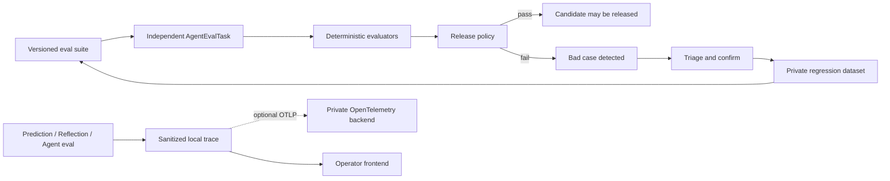

# Agent 评测、Benchmark、Bad Case 与 Trace

forecast-loop 现在把 Agent 的“能否发布”与“如何排障”拆成两个相互关联、但权威性不同的平面：

- 评测平面使用冻结 suite、确定性 evaluator 和版本化 release policy，产出可审计的发布结论；
- 遥测平面保存经过裁剪的 trace/span，便于定位节点、模型和验证阶段，但绝不改变正式预测、Reflection 或评价结果。

正式前端新增：

- `/evaluations`：suite 选择、baseline/candidate 比较、release gate 与 bad-case 回流；
- `/observability`：24 小时运行健康、P95、失败/降级和 trace 账本；
- `/traces/:traceId`：Agent、外部 Codex、validator 与 persistence 节点时间线。

## 系统边界



Python 仍负责 schema、hash、时间、来源、聚合和 release gate。LLM judge 只能形成 `judge_advisory`，不能单独放行候选版本。Trace 写入或 OTLP 导出失败时，正式工作流继续，trace 标记为 `telemetry_complete=false`。

## 快速开始

首次使用先迁移：

```bash
make migrate
```

查看可用 suite：

```bash
make agent-eval-list
```

运行公开的 20-case 合成基准：

```bash
make agent-eval ARGS="--suite agent-workflow-v1 --baseline baseline-v1 --candidate candidate-v2"
```

命令返回非零代表没有得到 `pass`，因此可以直接作为 CI gate。API 的 `POST /api/agent-evals/experiments` 会先持久化独立任务，再由后台任务执行；进程中断时任务仍保留在数据库，可由同一 CLI 再次执行队列中的任务。

## Suite v1

公开基准位于 `benchmarks/agent-workflow-v1/suite.json`，只包含合成数据。私有回放 suite 放在：

```text
data/evals/suites/<suite-id>/suite.json
```

Agent Eval v2 的可信 outcome suite 使用独立的
`FORECAST_LOOP_AGENT_EVAL_OUTCOME_ROOT`（默认 `data/eval-outcomes`），不得位于或挂载到
`data/evals/handoffs`。激活还要求
`FORECAST_LOOP_AGENT_EVAL_RELEASE_CANDIDATE_HASH` 精确匹配 candidate 的完整冻结清单。
核心代码会验证 root 非 symlink、与 handoff 目录互不包含并 fail closed；但当外部 Codex
任务与 finalize 进程使用同一 OS 用户且拥有相同文件权限时，Python 进程无法证明任务没有
读取 outcome。生产部署必须用 Codex sandbox、容器挂载或 OS ACL 保证 outcome root 只对
确定性 host finalize 可读。

同理，四份 draft 内的 `generated_by.producer` 只是被校验的声明，不能单独证明执行主体
彼此独立。release 环境必须让 baseline、candidate、reviewer、ablation 由四个独立任务生成，
并在 host 边界保存由调度器签发或注入的 task receipt；在尚未接入可验证 receipt 前，核心只
能拒绝重复 producer ID，不能把这些字符串描述成进程级或权限级隔离证明。

核心契约为 `forecast-loop.agent-eval-suite/v1`。每个 case 冻结：

- `workflow_kind`、`expected_trajectory`、标签与 `must_pass`；
- 每个 target 的完成状态、实际 trajectory 和 deterministic hard gates；
- 已有可信 outcome 计算出的 direction/Brier；
- latency、token 和可选的 advisory qualitative score。

v1 fixture runner 不调用模型。Reflection v1 只回放已经完成并封签的 package，不把 Codex 变成批量同步依赖，也不重新解释历史输入。

## 默认发布策略

`policy_version=1.0.0` 的默认要求：

| 门禁 | 阈值 |
| --- | ---: |
| must-pass trajectory + hard gate | 100% |
| 独立 outcome cases | 至少 20 |
| candidate Brier - baseline Brier | ≤ 0.01 |
| baseline direction accuracy - candidate accuracy | ≤ 2 个百分点 |
| P95 latency ratio | ≤ 1.20× |
| mean token ratio | ≤ 1.15× |

样本不足且没有 hard-gate 失败时返回 `insufficient_sample`，不是 `pass`。定性 judge 始终是 advisory。

## Bad case 回流

状态机固定为：

```text
detected -> triaged -> confirmed -> materialized -> resolved
                    \-> rejected
```

每次转换都写入 append-only `agent_bad_case_events`，事件包含前序 hash。`materialized` 只接受已经确认的 `test_case`，并原子写入：

```text
data/evals/datasets/<dataset-id>/<dataset-version>/<bad-case-id>.json
```

`data/` 始终是私有边界。不得把真实 prompt、客户数据、operator 路径或 Live 研究材料复制到公开 benchmark。

## Trace 数据策略

本地 trace 覆盖：

- prediction：冻结快照、Wiki 读取、研究 Agent、策略、Risk Critic、证据 validator、
  CIO 与持久化回执；
- reflection：prepare、Codex source discovery、freeze sources、Codex analysis、finalize；
- agent eval：suite 与确定性 evaluator 执行。

Trace v2 把一次实际执行尝试作为账本单位。同一 workflow subject 的每次 retry 都产生
递增的 `attempt_number`，不会复用或覆盖已结束的 trace。固定层级为运行根节点、预测
目标、Agent 调用、校验、聚合和持久化；`parent_span_id` 只能指向同一 trace 中已经存在
的 span。完成、失败或降级均会封签 trace，之后 trace、span 和 artifact link 都不能修改
或删除。历史 v1 trace 迁移后保留为 attempt 1，仍可原样读取。

`agent_trace_artifact_links` 只保存 artifact 身份、可选内容 hash 与关系，不复制 artifact
正文。支持的 artifact 为 signal、forecast、evaluation、reasoning review、Reflection 和
bad case；自然观点复用使用 `reused` 关系，避免把历史信号伪装成当天重新调用。Codex
file handoff 的外部阶段没有可信本地计时时，使用 external span 或 receipt 身份，不推测
耗时。

每个 prediction Agent span 从正式运行回执投影其 Wiki entry、版本、稳定 section 与
evidence item ID，可从 Trace 跳转到精确 Wiki section、原始证据或投委会审计详情。节点
展开后只展示 allowlist 元数据、脱敏输入/输出摘要、工具名称、模型/Agent 版本、时间、
token/cost（可用时）、错误与输入输出 digest。不保存完整 prompt、工具敏感参数、原始
模型响应或业务正文。完整事实仍由原预测/Reflection 审计包承担。

设置 `OTEL_EXPORTER_OTLP_TRACES_ENDPOINT` 后，同一批 span 会通过 OpenTelemetry OTLP/HTTP 镜像到私有后端。Opik 可以作为可选的自托管后端，但 forecast-loop 不依赖 Opik 才能运行；后端不可用不会阻断正式流程。`FORECAST_LOOP_AGENT_TRACE_EXTERNAL_URL` 只控制前端的外部下钻链接。

需要查看一次 Agent 实际做了什么时，可在运行主机安装实现
`evalmesh.RuntimeTracer` 契约的可选包，并把
`FORECAST_LOOP_AGENT_RUNTIME_TRACE_POLICY` 指向 Git worktree 之外、权限为 `0600` 的私有
策略文件。策略中的目标项目、凭证、原始 JSONL 输出位置和内容捕获开关不得进入本仓库。
Agent 与私有 backend 同机时使用 loopback policy；Agent 位于其他节点时，只允许经过认证的
私有网络 HTTPS policy，并要求 `allow_remote=true`。真实 endpoint、运行节点名称和 policy
路径不得出现在文档、示例、环境模板或 smoke 命令中。
启用后，真实执行入口会生成一条 execution root Trace：Input 是冻结证据与 Wiki 组成的
实际任务输入，Output 是最终封签 forecast；共享 provider 分发层记录 `llm` span，冻结输入、
validator 和持久化边界分别记录 `tool`、`guardrail` 或 `general` span，并保留父子关系、耗时
与错误状态。只有实际发生的调用会生成 span，健康检查和 synthetic validation 不算运行证明。

该桥接不改变公开数据面：`agent_traces` 和 `agent_trace_spans` 仍只保存 allowlist 元数据、
摘要与 digest，公开 API/UI 不返回 Prompt、模型正文或工具 I/O。私有 delivery 或可选包初始化
失败时，业务执行继续，本地 attempt 标为 `telemetry_complete=false` / `degraded` 并记录有限
错误类型。受控 smoke run 必须在私有后端同时确认非空 root Input/Output、至少一个真实模型
调用产生的 `llm` span，以及本次运行确实发生的 tool spans。smoke 报告还必须写明运行主机
类别、endpoint 类型和 Opik Trace ID；跨节点 smoke 在导出真实内容前必须取得明确授权。

当前版本不自动删除 trace，也不改写历史 trace。历史 prediction 详情页会从其不可变运行
回执只读投影 Wiki 读取、持久化和引用血缘节点，并标记为
`derived_from_immutable_receipt`；新运行会直接记录同类 span。后续如需 retention，必须
单独制定保留期和不可逆删除审批。

`GET /api/agent-traces` 使用按 `started_at,id` 的不透明 cursor 分页，并支持 workflow、
target、Agent、horizon、status 和起止时间过滤；详情返回 artifact links。Observability
summary 同时返回 trace/span/link 数量、数据库物理大小（可用时）和可配置容量告警；
`FORECAST_LOOP_AGENT_TRACE_STORAGE_WARNING_BYTES` 默认 1 GiB。容量告警只用于运维，
不会触发自动清理，也不会阻断预测。

## 自动化层级

- PR CI：运行公开合成 suite、完整 Python 测试、前端测试与构建；
- Private scheduled replay：使用私有 replay suites 跑全量回归，保持服务 loopback-only；
- 发布前：must-pass bad cases 必须 100%，并满足 20-case 统计门槛；
- 线上发现：从 trace 建 bad case，经人工确认后才 materialize 到下一版离线集。

所有新增 API 在 Live 模式下都使用已有 operator Bearer 保护。正式前端继续通过 loopback Vite proxy 在服务端注入 token，token 不进入 `VITE_*`、浏览器存储或前端 bundle。

## Agent Eval v2：结果盲化的文件回放

v1 合成 fixture 和数据库任务保持兼容。需要运行私有全链路回放时，使用独立的
`forecast-loop.agent-eval-suite/v2` 契约和显式文件边界：

```bash
make agent-eval-prepare ARGS="--suite private-replay-v2 --source private \
  --baseline baseline-v1 --candidate candidate-v2"
# 两个独立 forecast task 只写：
# <job-dir>/baseline-v1/drafts.json
# <job-dir>/candidate-v2/drafts.json
# 两份 forecast 均完成后，另起两个独立且结果盲化的 task：
# <job-dir>/reviewer/drafts.json
# <job-dir>/ablation/drafts.json
make agent-eval-status ARGS="<job-dir>"
make agent-eval-finalize ARGS="<job-dir>"
```

`prepare` 返回 `awaiting_draft`，冻结以下身份并写入只读 `input.json`：

- suite、市场 target 和每个独立 episode 的 input hash；
- baseline/candidate 各 target 的模型、Agent、prompt、workflow、Research Program、
  aggregation 和 Wiki 版本及 content hash；
- evidence cutoff、引用目录、expected trajectory 和 must-pass 标记。

真实 outcome 只存在于受信 suite，绝不写入 `input.json`、`reviewer/input.json`、
`ablation/input.json` 或草稿模板。Reasoning reviewer 只能读取结果盲化的 episode 和已经
完成的两份 arm 草稿；每条评分同时绑定 episode input hash 与所审核的完整 arm output
hash。Ablation task 读取冻结 candidate manifest、完整 outcome-free episode、每个 Agent
的版本/prompt，以及确定性的 `contribution_enabled=false, impact=none,
importance=none, abstained=true` 覆盖规则，然后独立重跑候选聚合。其输出绑定 candidate
full output hash、ablation input hash、target、Agent 与 assignment ID。

只有 baseline、candidate、reviewer、ablation 四份草稿均完整覆盖期望矩阵，且所有
suite/input/manifest/output 封签一致时，`finalize` 才重新加载受信 suite 并揭示 outcome。
缺少任一草稿时 status 保持 `awaiting_draft`；四份均验证后才是 `ready_to_finalize`。
Finalize 不提供 HTTP 入口。为兼容早期生成器，arm 草稿里的内嵌
`reasoning_review`/`ablations` 字段可以被解析，但不会参与任何评分或门禁。

`forecast-loop.agent-eval-report/v2` 按市场 target 分开输出：

- schema、cutoff、citation、trajectory 与 must-pass bad case 的 100% hard gate；
- 至少20个独立 episode，以及 Brier、方向、P95 latency 和平均 token 门禁；
- 固定五维、每维0–2分的 outcome-blind reasoning summary，始终仅为 advisory；
- 把单个 Agent 替换为明确 `no_impact` 后的 Brier ablation 摘要。

Reasoning review 必须由不同于 baseline、candidate 和 ablation 的独立任务提交，固定
`gpt-5.6-sol / high`。四个 task producer ID 必须互不相同；模型自评、输出哈希不一致，
或 reviewer/ablation 草稿中出现 realized outcome 字段都会被边界校验直接拒绝。

只有标记 `release_gate=true` 的 target 参与整体发布结论。任一正式 target 失败则整体
`fail`；hard gate 通过但样本不足时为 `insufficient_sample`。Shadow target 仍产生完整
诊断，但不阻断发布。Report 和 receipt 均为不可变本地文件，再次 finalize 只验证并返回
原结果。

可通过 CLI 导出以下公共 JSON Schema（除原四项外新增独立 review/ablation 契约）：

```bash
forecast-loop contract schema agent-eval-suite-v2
forecast-loop contract schema agent-eval-input-v2
forecast-loop contract schema agent-eval-drafts-v2
forecast-loop contract schema agent-eval-review-input-v2
forecast-loop contract schema agent-eval-review-draft-v2
forecast-loop contract schema agent-eval-ablation-input-v2
forecast-loop contract schema agent-eval-ablation-draft-v2
forecast-loop contract schema agent-eval-report-v2
```
