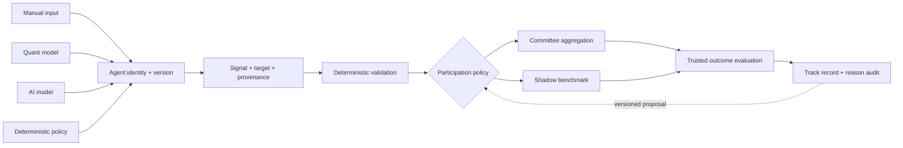

# Agent 框架模型

## 核心定义

在 forecast-loop 中，**Agent 不是 LLM 的同义词**。Agent 是一个具有稳定身份与版本、
针对明确预测目标提交事前信号，并在目标到期后接受可追溯评价的信号生产者。

信号可以来自：

- `manual`：由操作者手动输入；
- `quant`：由市场数据、特征、统计模型或量化程序生成预测信号；
- `ai`：由 LLM 或其他 AI 模型生成；
- `deterministic`：由版本化聚合器、规则基线或明确的 Python 决策政策产生。

分类按该 Agent 版本的主要 provenance 确定：Quant 从市场输入产生预测，deterministic
policy 则按已声明规则聚合或转换其他已验证信号。

来源不决定权力。Agent 是否进入正式聚合、处于 shadow、可以提交哪些字段、采用哪些
评分指标，必须由独立的版本化政策决定。

## 三个正交维度

一个 Agent 至少有三个互不替代的维度：

| 维度 | 示例 | 回答的问题 |
| --- | --- | --- |
| 身份 | `agent_id`、`agent_version` | 谁、哪个版本提交了信号？ |
| 职责 | research、strategy、critic、decision | 它在流程中负责什么？ |
| 来源 | manual、quant、ai、deterministic | 信号如何产生？ |

能力也不能从来源名称猜测。每个接入路径还应声明是否支持：

- 完整 `up / neutral / down` 概率；
- 证据快照与逐条引用；
- 理由、最强反证与可观察失效条件；
- 结果揭晓前的独立提交；
- 正式委员会参与或仅 shadow 评价。

只有提交完整规范化概率的 Agent 才能计算 Brier 与 calibration；没有冻结证据的任何
输入路径都不能声称和其他 Agent 共享完全相同的 evidence cutoff。纯校验器负责验证
signal envelope，不属于提交预测信号的 Agent。

## 共同验真生命周期

不同来源可以使用不同执行与存储适配器，但框架要求它们尽量收敛到同一验真生命周期：

共同的审计 envelope 至少应表达：

1. Agent 身份、版本与来源类型；
2. 指数、周期、基准日和目标日；
3. 服务端接收时间、提交截止和输入绑定；
4. 方向，以及该来源实际支持的概率或强度字段；
5. 理由、反证、失效条件和可用的证据 provenance；
6. 不可变内容哈希；
7. 可信市场结果、评价政策版本和评价哈希。

“共同”指字段语义与治理原则可比较，不代表所有 Agent 必须共用一张数据库表，或拥有
完全相同的输入、概率能力和评分指标。

## v0.1 当前实现

| 来源 | 当前链路 | 持久化 | 状态 |
| --- | --- | --- | --- |
| AI / Codex | `ResearchProvider -> AgentDraft -> AgentOpinion` | `AgentOpinion`、`OpinionEvaluation` | 已实现；角色与 LangGraph 拓扑固定 |
| 手动输入 | `UserJudgmentCreate -> UserJudgment -> UserJudgmentEvaluation` | 独立私有账本 | 已实现；shadow-only |
| 量化模型 | 只读 bundle → `AgentSignalDraft` → `SignalEnvelope` | append-only 通用 envelope；独立评价 | 已实现首个合成 adapter；shadow-only，不进旧委员会 |
| 确定性 CIO | 固定聚合与不确定性折扣 | `Forecast` 与 CIO Opinion | 已实现；不是 LLM 输出 |

`GET /api/agents` 已把 `workflow_role` 和 `source_type` 作为注册元数据公开；旧 `kind` 因
执行逻辑与 v1 hash 兼容而保留，不能再把它解释成统一职责分类。注册来源是默认适配器
类型，不是单次 run provenance；实际 provider、model、prompt 和输入仍以 run/opinion
封签为准。

这两个新字段没有加入现有 v1 run 输入哈希或历史协议；将职责、来源和能力写入正式预测
envelope 时，必须升级对应 schema 与 workflow 版本，不能原地改变旧制品的 canonical
bytes。`/api/agents` 仍处于 v0.1 首次公开发布前，因此本次响应 schema 调整按 pre-release
contract reset 管理。

## 已实现的统一契约边界

v0.1 已实现平行于旧工作流的版本化公共契约：

1. `AgentSpec` 冻结身份、职责、来源、能力、独立参与政策和内容哈希；
2. `SignalEnvelope` 冻结目标、截止时间、输入绑定、单次 provenance、来源 payload
   和内容哈希；
3. evaluation facade 按 capability 选择方向、三分类概率、校准和 reasoning
   可审核性；没有完整概率时 Brier、calibration 与 ECE 必须为空；
4. `AgentSignalSource` Port 只返回不可信 `AgentSignalDraft`；宿主用
   `accept_signal_draft` 独立绑定 target、receipt time、deadline、provenance、run 和
   当前批准的 AgentSpec，再封签 SignalEnvelope；
5. `agent_specs` 与 `signal_envelopes` 以 append-only 记录保存历史 spec、完整 envelope
   和 formal/shadow 路由投影，不回填无法证明 provenance 的旧记录；
6. 接收边界验证 run/input hash/as-of/cutoff，参与政策实际决定 formal 或 shadow 路由；
7. 新 admission 只接受宿主当前批准的 spec；归档 spec 仅用于历史验证和幂等重放；
8. API 与 CLI 可读取 AgentSpec、获取 JSON Schema，并使用当前或归档 spec 离线验证
   SignalEnvelope。

完整字段、canonical bytes 与失败关闭规则见
[AgentSpec 与 SignalEnvelope 契约](agent-contracts.md)。

这仍不是任意 Agent 即插即用的动态插件系统。下一阶段还需增加：

1. provider / data adapter 的更多真实兼容实现；
2. 可再分发的跨来源 benchmark；
3. 只有经过 shadow replay 和明确 activation event 的 Agent 才能进入未来正式聚合。

首个 Quant bundle、五类 artifact provenance 和只读失败关闭规则见
[只读 Quant Agent adapter](quant-adapter.md)。

手动输入没有必要强塞进 `AgentOpinion`。它的隐私、提交截止、自我声明和概率缺失都是
独立语义；框架统一的是身份、信号 envelope、评价和治理，而不是抹平不同来源。

旧 `AgentDefinition` 与 `AGENTS` 顺序继续服务 v1 workflow input hash、handoff matrix
和 run bundle；新契约没有改变历史序列化。真正把通用 envelope 接入正式聚合时，必须
显式升级 workflow 与交接协议，不能把新 spec hash 悄悄写入旧 hash 算法。
